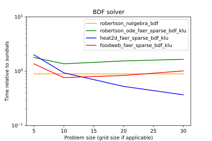
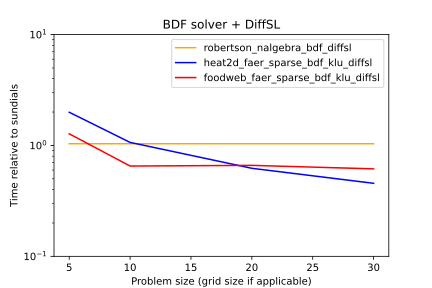

# Benchmarks

The goal of this chapter is to compare the performance of the DiffSol
implementation with other similar ode solver libraries. To begin with we have
focused on comparing against the popular
[Sundials](https://github.com/LLNL/sundials) solver suite, developed by the
Lawrence Livermore National Laboratory. 

## Test Problems
To choose the test problems we have used several of the examples provided in the Sundials library. The problems are:
- `robertson` : A stiff DAE system with 3 equations (2 differential and 1 algebraic). In the Sundials examples this example is part of the IDA examples 
  and is contained in the file `ida/serial/idaRoberts_dns.c`. In Sundials the problem is solved using the Sundials dense linear solver, in DiffSol we use the
  dense LU linear solver, dense matrices and vectors from the [nalgebra](https://nalgebra.org) library.
- `robertson_ode`: The same problem as `robertson` but in the form of an ODE. This problem has a variable size implemented 
  by duplicating the 3 original equations \\(n^2\\) times, where \\(n^2\\) is the size input parameter. In Sundials problem is solved using the KLU sparse linear solver and the Sunmatrix_Sparse matrix, and in DiffSol we use the
  same KLU solver from the [SuiteSparse](https://github.com/DrTimothyAldenDavis/SuiteSparse) library along with the [faer](https://github.com/sarah-ek/faer-rs) sparse matrix. 
  This example is part of the Sundials CVODE examples and is contained in the file `cvode/serial/cvRoberts_block_klu.c`.
- `heat2d`: A 2D heat DAE problem with boundary conditions imposed via algebraic equations. The size \\(n\\) input parameter sets the number of grid points along each dimension, so the
  total number of equations is \\(n^2\\) This example is part of the IDA examples and is contained in the file `ida/serial/idaHeat2D_klu.c`. 
  In Sundials this problem is solved using the KLU sparse linear solver and the Sunmatrix_Sparse matrix, and in DiffSol we use the same KLU solver along with the faer sparse matrix.
- `foodweb`: A predator-prey problem with diffusion on a 2D grid. The size \\(n\\) input parameter sets the number of grid points along each dimension and we have 2 species, so the
  total number of equations is \\(2n^2\\) This example is part of the IDA examples and is contained in the file `ida/serial/idaFoodWeb_bnd.c`.
  In Sundials the problem is solved using a banded linear solver and the Sunmatrix_Band matrix. DiffSol does not have a banded linear solver, so we use the KLU solver for this problem along with the faer sparse matrix.

## Method

In each case we have taken the example files from the Sundials library using version 6.7.0, compiling and linking them against the same version of the code. 
We have made minimal modifications to the files to remove all `printf` output and to change the `main` functions to named functions to allow them to be called from rust.
We have then implemented the same problem in Rust using the DiffSol library, porting the residual functions defined in the Sundials examples to DiffSol-compatible functions representing the rhs, mass matrix and jacobian multiplication functions for the problem.
We have used the outputs published by the Sundials examples as the reference outputs for the tests to ensure that the implementations are equivalent.

There are a number of differences between the Sundials and DiffSol implementations that may affect the performance of the solvers. The main differences are:
- The Sundials IDA solver has the problem defined as a general DAE system, while the DiffSol solver has access to the RHS and mass matrix functions separately.
  The Sundials CVODE solver has the problem defined as an ODE system and the mass is implicitly an identity matrix, and this is the same for the DiffSol implementation for the `robertson_ode` problem. 
- In the Sundials examples that use a user-defined jacobian (`robertson`, `robertson_ode`, `heat2d`), the jacobian is provided as a sparse or dense matrix. In DiffSol the jacobian is provided as a function that multiplies the jacobian by a vector,
  so DiffSol needs to do additional work to generate a jacobian matrix from this function.
- Generally the types of matrices and linear solver are matched between the two implementation (see details in the "Test Problems" section above). However, the `foodweb` problem is slightly different in that 
  it is solved in Sundials using a banded linear solver and banded matrices and the jacobian is calculated using finite differences.
  In DiffSol we use the KLU sparse linear solver and sparse matrices, and the jacobian is calculated using the jacobian function provided by the user.
- The Sundials implementations make heavy use of indexing into arrays, as does the DiffSol implementations. In rust these indexes are bounds checked, which affects performance slightly but was not found to be a significant factor. 

Finally, we have also implemented the `robertson`, `heat2d` and `foodweb`
problems in the DiffSl language. For the `heat2d` and `foodweb` problems we
wrote out the diffusion matrix and mass matrix from the rust implementations and
wrote the rest of the model by hand. For the `robertson` problem we wrote the
entire model by hand. 

## Results

The performance of each implementation was timed and includes all setup and solve time. The exception to this is for the DiffSl implementations, where the JIT compilation for the model was not included in the timings 
(since the compilation time for the C and Rust code was also not included). 
We have presented the results in the following graphs, where the x-axis is the size of the problem $n$ and the y-axis is the time taken to solve the problem relative to the time taken by the Sundials implementation 
(so \\(10^0\\) is the same time as Sundials, \\(10^1\\) is 10 times slower etc.)

### Bdf solver

The BDF solver is the same method as that used by the Sundials IDA and CVODE solvers so we expect the performance to be largely similar, and this is generally the case.
There are differences due to the implementation details for each library, and the differences in the implementations for the linear solvers and matrices discussed above.

For the small, dense, stiff `robertson` problem the DiffSol implementation is very close and only slightly faster than Sundials (about 0.9).

For the sparse `heat2d` problem the DiffSol implementation is slower than Sundials for smaller problems (about 2) but the performance improves significantly for larger problems until it is at about 0.3.
Since this improvement for larger systems is not seen in `foodweb` or `robertson_ode` problems, it is likely due to the fact that the `heat2d` problem has a constant jacobian matrix and the DiffSol implementation has an advantage in this case.

For the `foodweb` problem the DiffSol implementation is generally quite close to IDA. 
It is again slower for small systems (about 1.5) and the performance improves for medium systems until it reaches a value of 0.7, but then performance starts to slowly decrease for larger systems until it is about 1.0 

For the `robertson_ode` problem the DiffSol implementation is generally slower then the Sundials CVODE implementation and is about 1.5 - 1.9 the time taken by Sundials. Since the same method and linear solver is used in both cases the cause of this discrepancy is not
due to these factors, but is likely due to the differences in how the jacobian is calculated (in Sundials it is provided directly, but DiffSol is required to calculate it from the jacobian multiplication function).

### Bdf + DiffSl

The main difference between this plot and the previous for the Bdf solver is the use of the DiffSl implementation rather than rust closures. The trends in each case are mostly the same, but the DiffSl implementation is slightly slower than the rust closures for most problems.
This difference is minimal, and can be seen most clearly for the small `robertson` problem where the DiffSl implementation is just above 1.0 times the speed of the Sundials implementation, while the rust closure implementation is about 0.9.
However, for larger systems the DiffSl is actually faster, which is probably due to the fact that the rust closures bound-check the array indexing, while the DiffSl implementation does not.

This plot demonstrates that a DiffSL implementation can be comparible in speed to a hand-written rust or C implementation, but much more easily wrapped and used from a high-level language like Python or R, where the equations can be passed down
to the rust solver as a simple string and then JIT compiled at runtime.