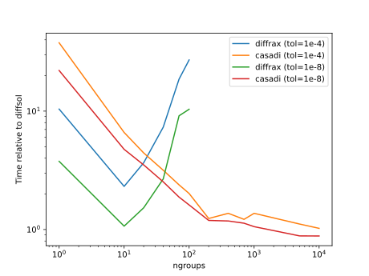

# Python (Diffrax & Casadi)

[Diffrax](https://docs.kidger.site/diffrax/) is a Python library for solving ODEs and SDEs implemented using JAX. [Casadi](https://web.casadi.org/) is a C++ library with Python and MATLAB bindings for solving ODE and nonlinear optimisation problems. In this benchmark we compare the performance of the Diffsol implementation with the Diffrax and Casadi libraries.

As well as demonstrating the performance of the Diffsol library, this benchmark also serves as an example of how to wrap and use Diffsol in other languages. The code for this benchmark can be found [here](https://github.com/martinjrobins/diffsol_python_benchmark). The [maturin](https://www.maturin.rs/) library was used to generate a template for the Python bindings and the CI/CD pipeline neccessary to build the wheels ready for distribution on PyPI. The [pyo3](https://github.com/PyO3/pyo3) library was used to wrap the Diffsol library in Python. 

## Problem setup

We will use the `robertson_ode` problem for this benchmark. This is a stiff ODE system with 3 equations and 3 unknowns, and is a common benchmark problem. To illustrate the performance over a range of problem sizes, the Robertson equations were duplicated a factor of `ngroups`, so the total number of equations solved is `3 * ngroups`.

The Diffrax implementation was based this on the [example](https://docs.kidger.site/diffrax/examples/stiff_ode/) in the Diffrax documentation, which was further extending to include the `ngroups` parameter. As is already used in the example, the `Kvaerno5` method was used for the solver. You can see the final implementation of the model [here](https://github.com/martinjrobins/diffsol_python_benchmark/blob/main/diffsol_python_benchmark/diffrax_models.py). 

The Casadi implementation was written from scratch using Casadi's python API. You can see the final implementation of the model [here](https://github.com/martinjrobins/diffsol_python_benchmark/blob/main/diffsol_python_benchmark/casadi_models.py).

The Diffsol implementation of the model written using the DiffSL language, you can see the final implementation of the model [here](https://github.com/martinjrobins/diffsol_python_benchmark/blob/main/diffsol_python_benchmark/diffsol_models.py).

The full implementation of the benchmark presented below can be seen [here](https://github.com/martinjrobins/diffsol_python_benchmark/blob/main/bench/bench.py). The Diffsol benchmark is performed using the `bdf` solver. For `ngroup` < 20 it uses the `nalgebra` dense matrix and LU solver, and for `ngroups` >= 20 the `faer` sparse matrix and LU solver are used.

## Differences between implementations

There are a few key differences between the Diffrax, Casadi and Diffsol implementations that may affect the performance of the solvers. The main differences are:
- The Casadi implementation uses sparse matrices, whereas the Diffsol implementation uses dense matrices for `ngroups` < 20, and sparse matrices for `ngroups` >= 20. This will provide an advantage for Diffsol for smaller problems.
- I'm unsure if the Diffrax implementation uses sparse or dense matrices, but it is most likely dense as JAX only has experimental support for sparse matrices. Treating the Jacobian as dense will be a disadvantage for Diffrax for larger problems as the Jacobian is very sparse.
- The Diffrax implementation uses the `Kvaerno5` method (a 5th order implicit Runge-Kutta method). This is different from the BDF method used by both the Casadi and Diffsol implementations. 
- Each library was allowed to use multiple threads according to their default settings. The only part of the Diffsol implementation that takes advantage of multiple threads is the `faer` sparse LU solver and matrix. Both the `nalgebra` LU solver, matrix, and the DiffSL generated code are all single-threaded. Diffrax uses JAX, which takes advantage of multiple threads (CPU only, no GPUs were used in these benchmarks). The Casadi implementation also uses multiple threads.

## Results

The benchmarks were run on a Dell PowerEdge R7525 2U rack server, with dual AMD EPYC 7343 3.2Ghz 16C CPU and 128GB Memory. Each benchmark was run using both a low (1e-8) and high (1e-4) tolerances for both `rtol` and `atol`, and with `ngroup` ranging between 1 - 10,000. The results are presented in the following graph, where the x-axis is the size of the problem `ngroup` and the y-axis is the time taken to solve the problem relative to the time taken by the Diffsol implementation (so `10^0` is the same time as Diffsol, `10^1` is 10 times slower etc.).

Diffsol is faster than both the Casadi and Diffrax implementations over the range of problem sizes and tolerances tested, although the Casadi and Diffsol implementations converge to be similar for larger problems (`ngroups` > 100). 

The Diffsol implementation outperforms the other implementations significantly for small problem sizes (`ngroups` < 5). E.g. at `ngroups` = 1, Casadi and Diffrax are between 3 - 40 times slower than Diffsol. At these small problem sizes, the dense matrix and solver used by Diffsol provide an advantage over the sparse solver used by Casadi. Casadi also has additional overhead to evaluate each function evaluation, as it needs to traverse a graph of operations to calculate each rhs or jacobian evaluation, whereas the DiffSL JIT compiler will compile to native code using the LLVM backend, along with low-level optimisations that are not available to Casadi. Diffrax is also significantly slower than Diffsol for smaller problems, this might be due to (a) Diffrax being a ML library and not optimised for solving stiff ODEs, or (b) double precision is used, which again is not a common use case for ML libraries, or (c) perhaps the different solver methods (Kvaerno5 vs BDF) are causing the difference.

As the problem sizes get larger, the performance of Diffrax and Casadi improve rapidly relative to Diffsol, but after `ngroups` > 10 the performance of Diffrax drops off again, probably due to JAX not taking advantage of the sparse structure of the problem. The performance of Casadi continues to improve, and for `ngroups` > 100 it is comparable to Diffsol. By the time `ngroups` = 10,000, the performance of Casadi is identical to Diffsol.