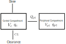

# Example: Compartmental models of Drug Delivery

The field of Pharmacokinetics (PK) provides a quantitative basis for describing the delivery of a drug to a patient, the diffusion of that drug through the plasma/body tissue, and the subsequent clearance of the drug from the patient's system. PK is used to ensure that there is sufficient concentration of the drug to maintain the required efficacy of the drug, while ensuring that the concentration levels remain below the toxic threshold. Pharmacokinetic (PK) models are often combined with Pharmacodynamic (PD) models, which model the positive effects of the drug, such as the  binding of a drug to the biological target, and/or undesirable side effects, to form a full PKPD model of the drug-body interaction. This example will only focus on PK, neglecting the interaction with a PD model.


PK enables the following processes to be quantified:

- Absorption
- Distribution
- Metabolism
- Excretion

These are often referred to as ADME, and taken together describe the drug concentration in the body when medicine is prescribed. These ADME processes are typically described by zeroth-order or first-order *rate* reactions modelling the dynamics of the quantity of drug $q$, with a given rate parameter $k$, for example:

\\[
\frac{dq}{dt} = -k^*,
\\]

\\[
\frac{dq}{dt} = -k q.
\\]

The body itself is modelled as one or more *compartments*, each of which is defined as a kinetically homogeneous unit (these compartments do not relate to specific organs in the body, unlike Physiologically based pharmacokinetic, PBPK, modeling). There is typically a main *central* compartment into which the drug is administered and from which the drug is excreted from the body, combined with zero or more *peripheral* compartments to which the drug can be distributed to/from the central compartment (See Fig 2). Each peripheral compartment is only connected to the central compartment.



The following example PK model describes the two-compartment model shown diagrammatically in the figure above. The time-dependent variables to be solved are the drug quantity in the central and peripheral compartments, $q_c$ and $q_{p1}$ (units: [ng]) respectively.

\\[
\frac{dq_c}{dt} = \text{Dose}(t) - \frac{q_c}{V_c} CL - Q_{p1} \left ( \frac{q_c}{V_c} - \frac{q_{p1}}{V_{p1}} \right ),
\\]

\\[
\frac{dq_{p1}}{dt} =  Q_{p1} \left ( \frac{q_c}{V_c} - \frac{q_{p1}}{V_{p1}} \right ).
\\]

This model describes an *intravenous bolus* dosing protocol, with a linear clearance from the central compartment (non-linear clearance processes are also possible, but not considered here). The dose function $\text{Dose}(t)$ will consist of instantaneous doses of $X$ ng of the drug at one or more time points. The other input parameters to the model are:

- \\(V_c\\) [mL], the volume of the central compartment
- \\(V_{p1}\\) [mL], the volume of the first peripheral compartment
- \\(CL\\) [mL/h], the clearance/elimination rate from the central compartment
- \\(Q_{p1}\\) [mL/h], the transition rate between central compartment and peripheral compartment 1

We will solve this system of ODEs using the Diffsol crate. Rather than trying to write down the dose function as a smooth mathematical function, we will treat each bolus dose as a discrete event. We first do this procedurally by stopping the solver at each dose time in Rust, then rewrite the same model declaratively using DiffSL `stop` and `reset` tensors.

First lets write down the equations in the standard form of a first order ODE system:

\\[
\frac{d\mathbf{y}}{dt} = \mathbf{f}(\mathbf{y}, t)
\\]

where

\\[
\mathbf{y} = \begin{bmatrix} q_c \\\\ q_{p1} \end{bmatrix}
\\]

and

\\[
\mathbf{f}(\mathbf{y}, t) = \begin{bmatrix} - \frac{q_c}{V_c} CL - Q_{p1} \left ( \frac{q_c}{V_c} - \frac{q_{p1}}{V_{p1}} \right ) \\\\ Q_{p1} \left ( \frac{q_c}{V_c} - \frac{q_{p1}}{V_{p1}} \right ) \end{bmatrix}
\\]

We will also need to specify the initial conditions for the system:

\\[
\mathbf{y}(0) = \begin{bmatrix} 0 \\\\ 0 \end{bmatrix}
\\]

For the dose function, we will specify a dose of 1000 ng at regular intervals of 6 hours. We will also specify the other parameters of the model:

\\[
V_c = 1000 \text{ mL}, \quad V_{p1} = 1000 \text{ mL}, \quad CL = 100 \text{ mL/h}, \quad Q_{p1} = 50 \text{ mL/h}
\\]

## Procedural approach

To implement the discrete dose events procedurally, we set a stop time for the simulation at each dose event using the [OdeSolverMethod::set_stop_time](https://docs.rs/diffsol/latest/diffsol/ode_solver/method/trait.OdeSolverMethod.html#tymethod.set_stop_time) method. During time-stepping we can check the return value of the [OdeSolverMethod::step](https://docs.rs/diffsol/latest/diffsol/ode_solver/method/trait.OdeSolverMethod.html#tymethod.step) method to see if the solver has reached the stop time. If it has, we apply the dose directly to the state and continue the simulation.

```rust,ignore
{{#include ../../../examples/compartmental-models-drug-delivery/src/main.rs}}
```

{{#include images/drug-delivery.html}}

## Declarative approach

The same dosing schedule can also be encoded directly in DiffSL. Here the initial condition includes the first dose at \\(t=0\\), the `stop` tensor contains the later dosing times \\(t = 6\\), \\(12\\), and \\(18\\) hours, and the `reset` tensor adds the bolus amount to the central compartment whenever any of those stop conditions fires.

Because the model supplies both `stop` and `reset`, the high-level `solve` method now applies each declarative dose automatically and continues through the full 24 hour simulation.

```rust,ignore
{{#include ../../../examples/compartmental-models-drug-delivery-declarative/src/main.rs}}
```

{{#include images/drug-delivery-declarative.html}}

## Adjoints through declarative dose events

The automatic reset handling provided by the declarative approach is useful when the reset itself depends on an input parameter. In the drug-delivery model, we can make the bolus dose an input parameter by putting `dose` in the DiffSL `in` tensor. The initial condition uses the same dose for the dose at \\(t=0\\), and the reset tensor adds `dose` to the central compartment at later dosing times.

In this example we will integrate the output of the central-compartment concentration squared, \\(AUC2 = \\int_0^{24} (q_c / V_c)^2 dt\\), and then use diffsol's adjoint capabilities to calculate the gradient of this integral with respect to the `dose` parameter. The integral of the squared concentration would not typically be of interest, but this example is slightly contrived so that the final gradient is not constant and the plots are non-trivial.

We solve the model forwards in time using checkpointing and extract `AUC2` from the final solution, and then create the adjoint equations using the checkpoints and integrate backwards in time to the starting time point. The gradient of `AUC2` with respect to `dose` is then extracted from `sg` on the final solver state. Repeating this for several dose levels gives the dose-response curve and its gradient.

DiffSL currently needs the LLVM backend for sensitivity-aware reset/root operators in this example.

```rust,ignore
{{#include ../../../examples/compartmental-models-drug-delivery-sensitivities/src/main_llvm.rs}}
```

{{#include images/drug-delivery-dose-sensitivity.html}}
